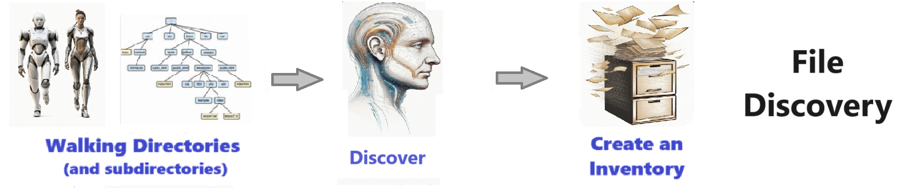
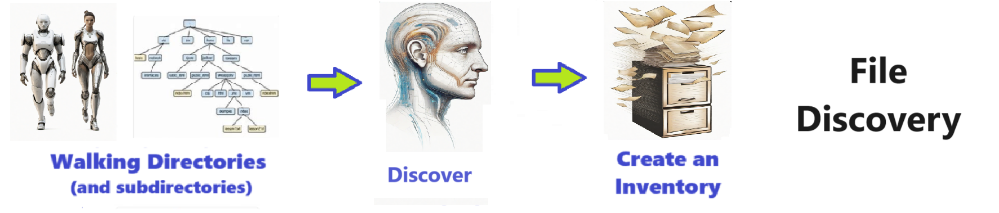

# File Discovery - Solution for File Discovery
Solution for File Discovery

Welcome to the solution **File Discovery** - an example for your projects

Solution for File Discovery
## instructions # File Discovery  - Find all your latest Data & Files 
# Its EASY and Automated 

## Description

Welcome to the ** File Disovery ** repository! This project demonstrates how find and register files - EASILY  !!! 

  

## Features

- Configurable - Finds all kinds of raw files like xlsx, txt, csv, pickle, feather, etc  
- Configurable - you set the root directory and it searches everywhere for data  
- Automates boring stuff 
- Easily Configurable 
- Makes your work open source 
- Invites Collaboration
- creative and Fun !!

## Notebook Features

- Self Documenting 
- Self Testing 
- Easily Configurable
- Includes Talking Code - The code explains itself
- Self Logging 
- Self Debugging 
- Low Code - or - No Code
- Educational 

## Getting Started

To get started with the **  File Disovery ** project, follow these steps:

1. Clone the repository to your local machine.
2. Install the required dependencies listed at the top of the notebook.
3. Explore the example code provided in the repository and experiment.
4. Run the notebook and your find your most Critical Data - EASY !

 

## Features
- Easy to understand and use  
- Easily Configurable 
- Quickly start your project with pre-built templates
- Its Fast and Automated

## Notebook Features
- **Self Documenting** - Automatically identifes major steps in notebook 
- **Self Testing** - Unit Testing for each ptyhon function
- **Easily Configurable** -easily modifyable with config.INI name value pairs
- **Includes Talking Code** - The code explains itself.
- **Self Logging** - enhanced python standard logging   
- **Self Debugging** - enhanced python standard debugging
- **Low Code - or - No Code** - Most solutions are under 50 lines of code
- **Educational** - Includes educational dialogue and background material
    
## Getting Started
To get started with the **File Discovery** solution repository, follow these steps:
1. Clone the repository to your local machine.
2. Install the required dependencies listed at the top of the notebook.
3. Explore the example code provided in the repository and experiment.
4. Run the notebook and make it your own - **EASY !**
    
## https://github.com/JoeEberle/ -- josepheberle@outlook.com 
    

       